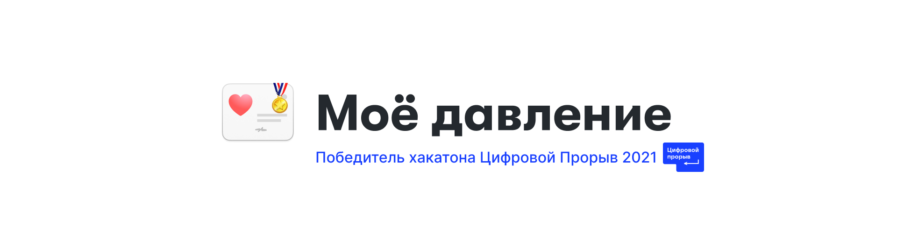
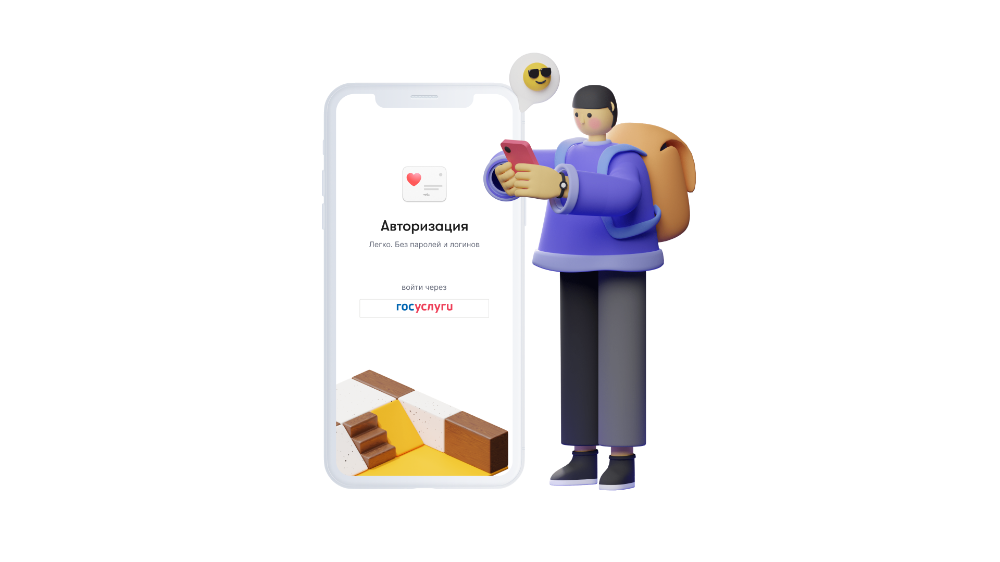

## О проекте

**Моё давление** - это сервис, в котором пациент автоматически делится с врачом замерами давления, а врач оперативно корректирует лечение.

### Ключевые особенности
- Вся необходимая пациенту информация размещена на единственной странице и упакована в лаконичные виджеты — пожилым людям будет очень легко разобраться. Для добавления замера достаточно нажать одну кнопку, ввести показатели и сразу увидеть, как они отобразятся на графике.
- Карточка пациента позволяет врачу не только анализировать показатели, но и просматривать всю историю болезни пациента, а также сохранять личные заметки, которые он считает важными.
- PWA архитектура позволяет уменьшить затраты на разработку, при этом давая пользователю возможность взаимодействовать сервисом как с компьютера, так и с телефона в виде мобильного приложения.


## Технологический стэк

- [Django](https://www.djangoproject.com/) - свободный фреймворк для веб-приложений на языке Python
- [DRF](https://www.django-rest-framework.org/) -  библиотека, которая работает со стандартными моделями Django для создания гибкого API
- [Vue 3](https://v3.ru.vuejs.org/) - прогрессивный JavaScript-фреймворк для создания фронтенда веб-приложения
- [Vuex](https://vuex.vuejs.org/ru/) - официальный менеджер состояний для VueJS
- [Router](https://router.vuejs.org/ru/) - официальный маршрутизатор для VueJS
- [TypeScript](https://www.typescriptlang.org/) - типизированный JavaScript, позволяющий отлавливать ошибки до запуска кода


## Демо




## Локальный запуск

```bash
git clone https://github.com/dipuzyrev/mbp

# Start API
cd backend
python3 -m venv env
source ./env/bin/activate  # WIN: "env\Scripts\activate"
pip install -r requirements.txt
python manage.py runserver

# Start frontend
cd ../frontend
yarn && yarn serve
```


### Локальные ссылки

- [Кабинет врача](http://localhost:8080/doctor/cp3twep8onrgy/)
- [Тестовый пациент](http://localhost:8080/) (patient@mbp.ru / supersecret)
- [Django админка](http://localhost:8000/admin/) (admin@mbp.ru / supersecret)


## Контакты
- [Дмитрий Пузырев](https://t.me/dipuzyrev) - бэкенд
- [Платон Лапп](https://t.me/SeamMiner) - фронтенд
- [Александр Щеблыкин](https://t.me/greeneboy) - десигн